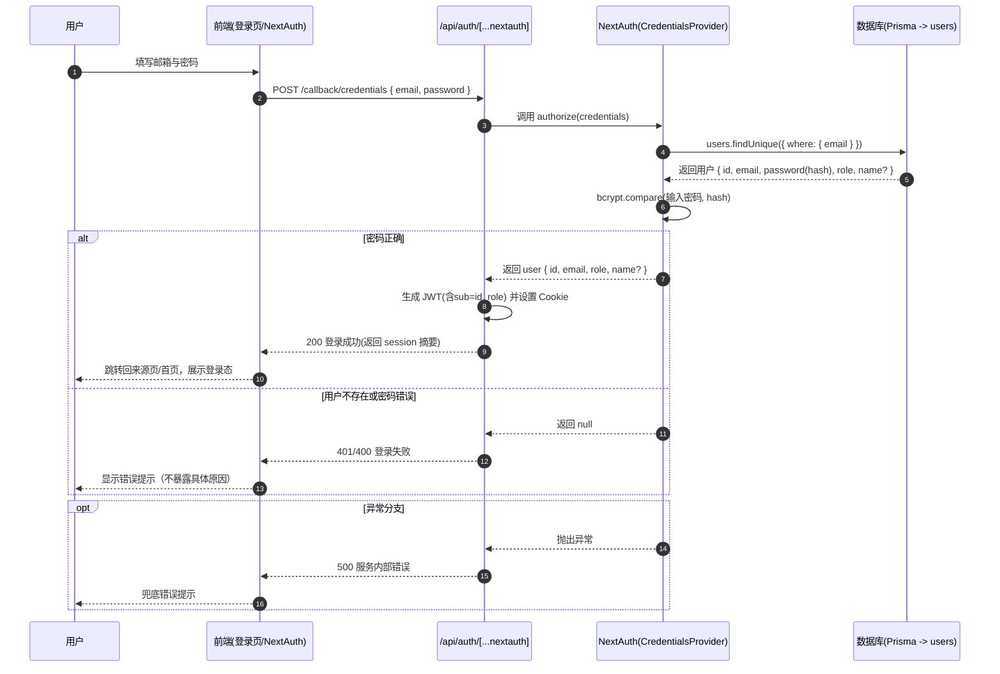

# 项目功能模块说明（简版）

面向产品与开发的模块化说明，聚焦“做什么、怎么用、交互怎么走”。如需更详细的架构图/时序图，可在此基础上拓展。

## 1. 用户与认证模块
- 目标：完成注册与登录授权，管理用户会话与角色。
- 主要接口：
  - POST `/api/auth/register`：注册账号（姓名/邮箱/密码/手机号）。
  - GET/POST `/api/auth/[...nextauth]`：NextAuth 标准授权入口（凭证登录）。
- 核心流程：
  - 注册：Zod 校验 → 查重邮箱 → bcrypt 加密密码 → 创建用户 → 返回基础信息。
  - 登录：凭证校验 → 查找用户 → 比对密码 → 生成 JWT，附加角色与用户ID → 返回会话。
- 关键文件：
  - `src/lib/auth.ts`（NextAuth 配置、providers、回调）
  - `src/app/api/auth/register/route.ts`（注册接口实现）

## 2. 个人资料模块
- 目标：维护用户可见信息（姓名、电话、头像、语言等）。
- 主要接口：
  - POST `/api/profile/update`：更新资料（需登录）。
  - POST `/api/profile/avatar`：上传头像（formData，图片类型校验）。
- 核心流程：
  - 更新：鉴权 → Zod 校验 → prisma.user.update → 返回更新信息。
  - 头像：鉴权 → 接收文件 → 类型校验/基础存储（示例为 base64）→ 更新头像 URL。
- 关键文件：
  - `src/app/api/profile/update/route.ts`
  - `src/app/api/profile/avatar/route.ts`
  - `src/lib/validations/auth.ts`

## 3. 订单与优先级模块
- 目标：创建、查询、更新用户订单，自动评估优先级与紧急程度。
- 主要接口：
  - GET `/api/orders`：按条件筛选订单（type、status、priority、isPriority、restaurantId、时间段等）。
  - PATCH `/api/orders`：更新订单（仅本人或管理员）。
  - POST `/api/orders`：创建订单（计算优先级）。
- 核心逻辑：
  - 过滤：支持按类型/状态/优先级/时间段等筛选；默认仅查询本人，管理员可查全部。
  - 优先级：基于金额、支付状态/订单状态、用户积分/角色、就餐/入住时间临近性，计算 score 映射 priority/urgency/isPriority。
- 请求/响应关键字段（简要）：
  - 创建入参：type、totalAmount、paymentMethod、paymentStatus?、bookingDate?、checkInDate?、checkOutDate?、guestCount?、specialRequests?、contactName/Phone、contactEmail?、关联资源ID?、status?
  - 返回字段：id、type、status、totalAmount、paymentStatus、bookingDate、checkInDate、priority、isPriority、urgencyLevel、priorityScore、创建/更新时间等。
- 关键文件：`src/app/api/orders/route.ts`

## 4. 餐厅可用性模块
- 目标：按时间段计算餐厅剩余席位，用于前端下单与排队提示。
- 接口：
  - GET `/api/restaurant/availability?restaurantId=xxx&slotStart=ISO&slotEnd=ISO`
- 核心逻辑：
  - 校验参数与时间区间 → 并行统计 PENDING 与 CONFIRMED 订单数 → `available = capacity - used`（默认 capacity=40，可后续迁移到餐厅模型字段）。
- 返回示例（字段）：restaurantId、slotStart/slotEnd、capacity、confirmedCount、pendingCount、available。
- 关键文件：`src/app/api/restaurant/availability/route.ts`

## 5. 地图检索模块（外部服务代理）
- 目标：服务端代理百度地点检索，隐藏 AK，避免前端跨域与泄露。
- 接口：
  - GET `/api/map/search?query=&region=&tag=&page_size=&page_num=&location=&radius=&scope=`
- 核心逻辑：
  - 读取 `BAIDU_MAP_AK` → 拼接查询参数 → 服务端 fetch 上游 → 透传响应。
- 关键文件：`src/app/api/map/search/route.ts`

## 6. 天气服务模块（外部服务代理）
- 目标：查询百度天气，支持按行政区或经纬度。
- 接口：
  - GET `/api/weather?district_id=&location=&data_type=&coordtype=`
- 核心逻辑：
  - 读取 AK（NEXT_PUBLIC 或服务端）→ 调用上游 → 透传 JSON。
- 关键文件：`src/app/api/weather/route.ts`

## 7. 公共库与数据
- Prisma Client 复用：`src/lib/prisma.ts`（进程内复用，开发环境挂载到 global）
- 认证配置：`src/lib/auth.ts`（credentials provider、jwt/session 回调、pages）
- 请求体验证（Zod）：`src/lib/validations/auth.ts`（SignIn/SignUp/UpdateProfile）
- 数据库模型：`prisma/schema.prisma`（包含用户、餐厅、订单等实体与枚举、索引、外键）
- SQL 导出：`prisma/schema.sql`（从 Prisma 模型生成的建库 DDL）

## 8. 安全与异常（简要）
- 鉴权与权限：NextAuth + JWT 角色；订单更新遵循“本人或管理员”。
- 密码安全：最小长度校验 + bcrypt 散列；服务端不返回明文密码。
- 输入校验：统一 Zod；异常返回 400（参数错误）、401（未授权）、403（无权限）、404（不存在）、5xx（服务内部/上游异常）。
- 机密管理：AK 等仅在服务端读取；地图/天气走服务端代理。
- 文件上传：仅图片，建议落地 OSS/S3 并做病毒扫描与大小限制。

## 9. 性能与扩展（简要）
- 性能：
  - 精准 `select` 字段，减少数据体积。
  - 并行统计（Promise.all），提升吞吐。
  - 为高频筛选字段建立索引（email、订单 type/status/restaurantId、bookingDate 等）。
- 扩展：
  - 餐厅容量模型化（按时段/包间）；优先级算法策略化（可配置权重与规则）。
  - 接口分页/游标；外部服务短期缓存；微服务化拆分（可用性、优先级计算）。
  - 可观测性：结构化日志、metrics、tracing；为注册/下单/支付链路设置告警。

---
如需更详细的图示版（流程时序/领域模型关系图）或导出接口文档（OpenAPI/Swagger、Postman 集合），可在此文档基础上进一步完善。

## 10. 各业务功能详细设计

### 10.1 用户与认证
- 角色与权限
  - 角色：USER、ADMIN（可扩展）。
  - 会话：JWT 策略，token 中携带 role、sub（用户ID）；服务端通过 getServerSession 获取。关键配置见 `src\lib\auth.ts`。
- 数据模型（关键字段）
  - User：id（PK）、email（唯一）、password（bcrypt hash）、name、phone、avatar、role、createdAt、updatedAt。
- 输入校验
  - 登录：`SignInSchema`（email、password 最小长度）。
  - 注册：`SignUpSchema`（name、email、password、confirmPassword 一致性、phone?）。
  - 更新：`UpdateProfileSchema`（name、phone?、avatar?、bio?）。见 `src\lib\validations\auth.ts`。
- 授权与会话回调
  - Credentials Provider：authorize 中按 email 查用户 → bcrypt.compare 校验密码。
  - jwt 回调：将 role 写入 token；session 回调：将 token.sub 写入 session.user.id，将 role 写入 session.user.role。
- 异常处理
  - 缺少参数/校验失败：返回 400。
  - 用户不存在/密码错误：返回 401/400（统一提示“邮箱或密码错误”可防枚举）。
  - 服务异常：返回 500 并记录日志。

### 10.2 个人资料
- 能力：更新 name、phone、avatar、language；上传头像（示例存 base64，生产建议存云对象存储）。
- 约束：需登录；头像仅限图片类型；建议限制体积与尺寸，并做病毒扫描；落地后回写 URL 至用户表。
- 关键接口与实现：
  - `POST /api/profile/update`：鉴权 → Zod 校验 → prisma.user.update → 返回更新后的字段。
  - `POST /api/profile/avatar`：鉴权 → formData 文件 → 类型校验 → 处理/存储 → prisma.user.update。

### 10.3 订单与优先级
- 能力：按条件查询、编辑状态与优先级、创建订单（自动评估优先级与紧急程度）。
- 权限：默认仅本人可查改；ADMIN 可查看全部并可修改。
- 优先级策略（示例）
  - 维度：金额、支付状态、订单状态、用户积分/角色、时间敏感性（距就餐/入住时间）。
  - 映射：score → priority（LOW/MEDIUM/HIGH/CRITICAL）、urgencyLevel（NORMAL/TIME_SENSITIVE/LAST_MINUTE）、isPriority（布尔）。
- 关键接口与实现：`/api/orders`（GET/PATCH/POST）。
  - GET：多条件过滤、排序、字段精选（select）。
  - PATCH：按传入字段部分更新；校验权限与字段合法性。
  - POST：校验必要字段 → 计算优先级 → prisma.order.create。
- 建议：引入幂等键（Idempotency-Key）避免重复下单；为高频查询字段建索引；分页/游标查询。

### 10.4 餐厅可用性
- 能力：依据时间段统计已用席位，返回剩余可用。
- 默认容量：40（建议迁移为 Restaurant 表字段，支持分时段/包间容量）。
- 实现：并行统计 PENDING 与 CONFIRMED 订单数量 → available = capacity - used。
- 接口：`GET /api/restaurant/availability?restaurantId=&slotStart=&slotEnd=`。

### 10.5 外部地图与天气
- 目标：通过服务端代理隐藏 AK，避免前端跨域与密钥泄露。
- 地图：`/api/map/search` 读取 BAIDU_MAP_AK，拼接参数代理调用并透传结果。
- 天气：`/api/weather` 读取 AK（服务端或 NEXT_PUBLIC），按 district_id 或 location 查询并透传结果。
- 建议：对外部结果做短期缓存；失败时透传上游状态码与错误文本，便于定位。

---

## 11. 用户登录功能时序图（详细设计）

- 关键实现位置与要点
  - 认证配置与回调：`src\lib\auth.ts`（authorize、jwt 回调写 role、session 回调写 user.id 与 role）。
  - 数据访问：`src\lib\prisma.ts` 进程内复用 PrismaClient；`prisma/schema.prisma` 定义 User 模型与索引。
  - 输入校验：`src\lib\validations\auth.ts` （邮箱格式、密码长度）。
  - 安全建议：失败提示统一；加入登录节流/限频；可选账号锁定策略；记录审计日志；合理 SameSite Cookie 与 HTTPS；避免把机密信息写入 JWT。